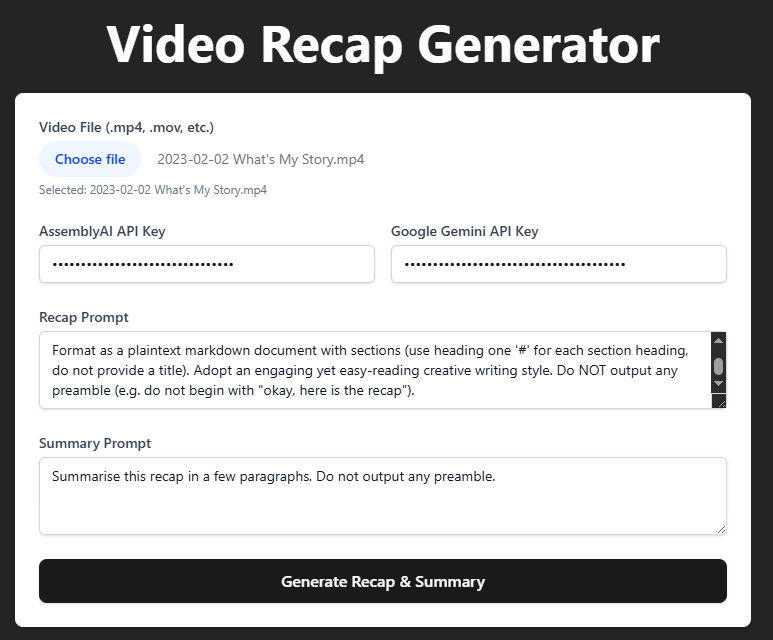

# Canon Keeper

Canon Keeper processes video recordings of Tabletop RPG (TTRPG) sessions.
It extracts audio, transcribes, generates recaps, and generally helps players and GMs maintain focus on the "in-universe" series of events.



## Quick Transcription (recommended)

The primary entry point now is the command-line transcriber. This is the fastest way to get a transcript from a video or audio file.

- Install and activate Python venv (see Requirements below).
- Install Python dependencies:

    ```bash
    pip install -r requirements.txt
    ```

- Install ffmpeg and add its /bin folder to an environment variable named FFMPEG (required). On Windows, you can add a system environment variable pointing to the ffmpeg bin folder. For convenience, Windows 10 users can add a command via regedit to the Explorer right-click context menu, and Windows 11 users can use tools such as Nilesoft Shell — but explicit registry/tool steps are not provided here.

- Transcribe a file:

    ```bash
    .venv\Scripts\activate
    python server\transcribe_file.py path\to\your\video_or_audio_file.mp4
    ```

- Output: a transcript file named <input>_transcript.txt will be written beside the input file.

## Requirements

- Install [Python: v3.13.2](https://www.python.org/downloads/release/python-3132/)
  - Create a virtual environment named `.venv`:

        ```bash
        python -m venv .venv
        ```

  - Activate it (every session)

        ```bash
        .venv\Scripts\activate
        ```

  - Install python packages

        ```bash
        pip install -r requirements.txt
        ```

- Install [ffmpeg: v2025-03-31-git-35c091f4b7](https://www.gyan.dev/ffmpeg/builds/) (Once extracted, add /bin folder to system PATH environment variable or set a system environment variable named FFMPEG pointing to the /bin folder)
- Install Node Version Manager [NVM](https://github.com/coreybutler/nvm-windows) for managing Node.js versions.
  - Install NodeJS:

    ```bash
        nvm install lts
        nvm use lts
    ```

  - Install package dependencies:

    ```bash
        cd client
        npm install
    ```

## Troubleshooting

If when running `pip install playsound` you get the following error: "Getting requirements to build wheel did not run successfully", then try running `pip install --upgrade setuptools wheel` first.

## Web App (optional)

The web application and development workflow are provided but are secondary to the CLI transcriber. If you prefer to run the web interface, follow these steps:

- Launch backend server:

    ```bash
    cd server
    uvicorn main:app
    ```

- Launch frontend server:

    ```bash
    cd client
    npm run dev
    ```

- Build:

    ```bash
    npm run build
    ```

## Tech Stack

**Backend:**

- **Framework:** FastAPI (High-performance ASGI web framework)
- **Server:** Uvicorn (ASGI server to run FastAPI)
- **File Handling:** `python-multipart` (for uploads), direct `ffmpeg` calls (for audio extraction)
- **Environment:** Python `venv` for dependency isolation

**Frontend:**

- **Language:** TypeScript
- **Framework/Library:** React
- **Build Tool / Dev Server:** Vite (Fast, modern frontend tooling)
- **Styling:** Tailwind CSS (Utility-first CSS framework)
- **Environment:** Node.js (LTS recommended) managed via NVM

**Code Quality & Tooling:**

- **Python Formatting:** Black
- **Python Linting:** Ruff
- **TS/JS Formatting:** Prettier
- **TS/JS Linting:** ESLint
- **CI/CD:** GitHub Actions (Linting and testing workflows)
